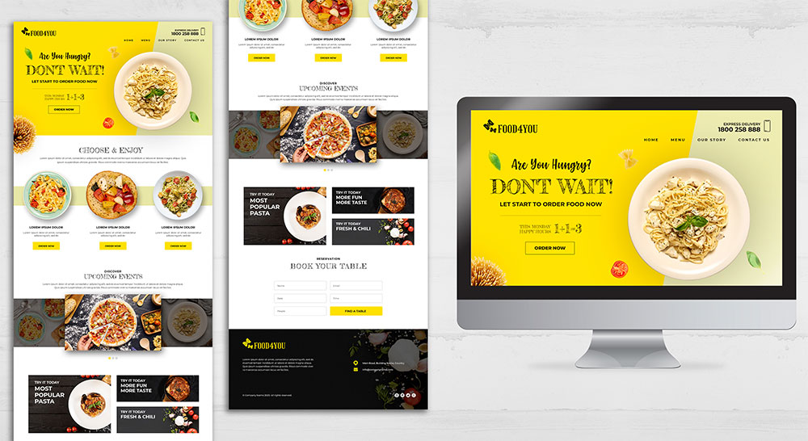

# PSD2HTML "Food For You"

## Description
My coding practice PSD-template to HTML/CSS with using SASS/SCSS, Grid Layout and Flexbox.

PSD-template image:


## Getting Started

#### Installation
For a start you need install project dependencies:
```
npm install
```

#### Usage
```
npm start
```

#### Other scripts
1. For development:
```npm run dev```
2. Build project:
```npm run build```


